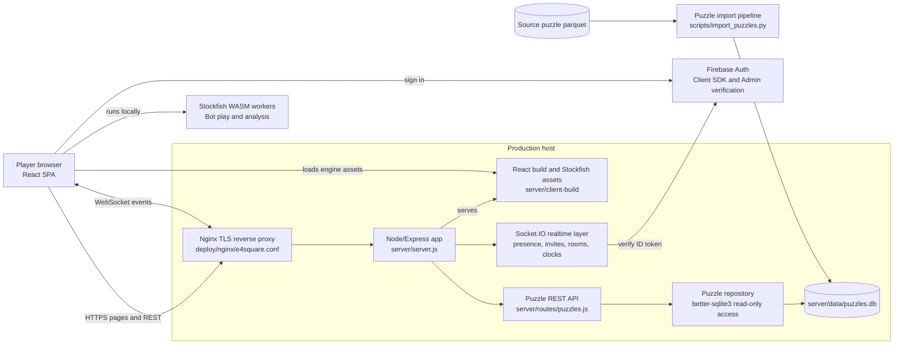

# E4Square

E4Square is a full-stack chess platform built around live multiplayer, bot play, and a puzzle trainer. It combines a responsive React chess interface with a Node.js real-time game server, Firebase authentication, Stockfish analysis, and a disk-backed puzzle database.

## Product

- Real-time online chess with lobby presence, friend games, clocks, resignations, reconnect handling, and abandonment outcomes.
- Bot games with takebacks, optional engine evaluation, and board arrows for analysis.
- Puzzle trainer with themed puzzle discovery, played-puzzle tracking, post-solve exploration, move-back support, and engine-assisted analysis.
- Board-first responsive UI designed for desktop and mobile chess workflows.

## Engineering Highlights

- Single-origin production app where Express serves the React build, API routes, Stockfish assets, and Socket.IO from one deployment.
- Firebase Auth on the client with Firebase Admin verification on the server for authenticated socket sessions.
- Socket.IO multiplayer lifecycle covering active-player presence, rematches, resignations, disconnects, reconnects, and game cleanup.
- SQLite puzzle repository opened read-only from disk, with bounded random sampling so large puzzle datasets are not loaded into memory.
- Streaming parquet-to-SQLite import pipeline for preparing large puzzle files without committing generated data.
- Stockfish worker lifecycle scoped to bot/eval usage so engine resources are started only when needed and terminated after use.

## Stack

React, chess.js, chessground/chessboard UI components, Socket.IO, Express, Firebase Auth, Firebase Admin, better-sqlite3, Stockfish WASM, and Docker.

## Architecture



## Demo

<table>
  <tr>
    <td width="50%">
      
    </td>
    <td width="50%">
      
    </td>
  </tr>

  <tr>
    <td width="50%">
      
    </td>
    <td width="50%">
      
    </td>
  </tr>

  <tr>
    <td colspan="2">
      
    </td>
  </tr>
</table>

## Repository Map

```text
client/                  React application and chess UI
client/public/stockfish  Browser Stockfish assets
server/                  Express API, Socket.IO server, Firebase Admin, puzzle API
server/data/             Local puzzle DB location, ignored by git
scripts/                 Puzzle import utilities
Dockerfile               Production container build
docker-compose.yml       Single-instance production app container
```
